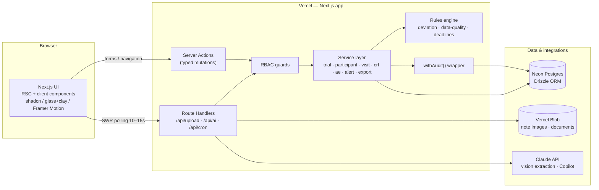
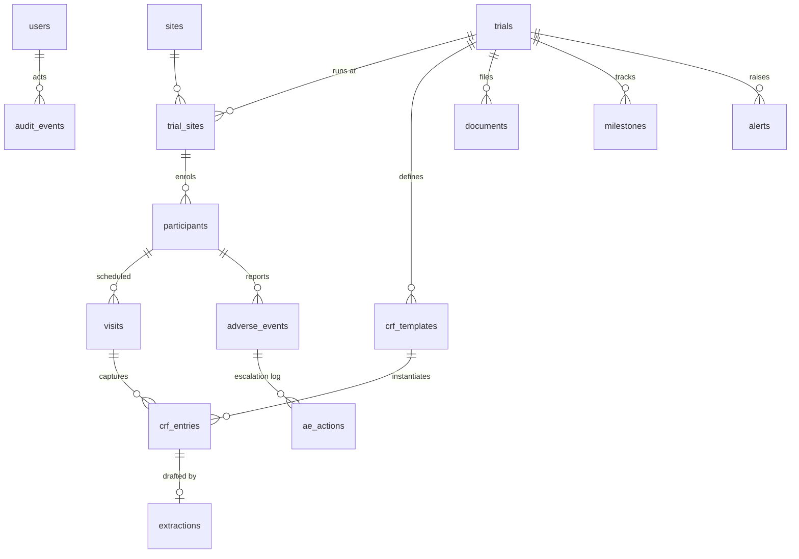
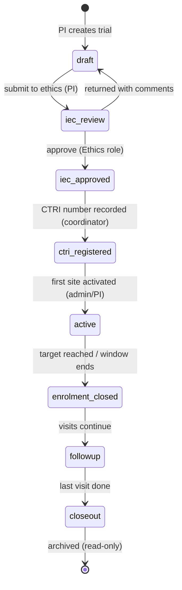
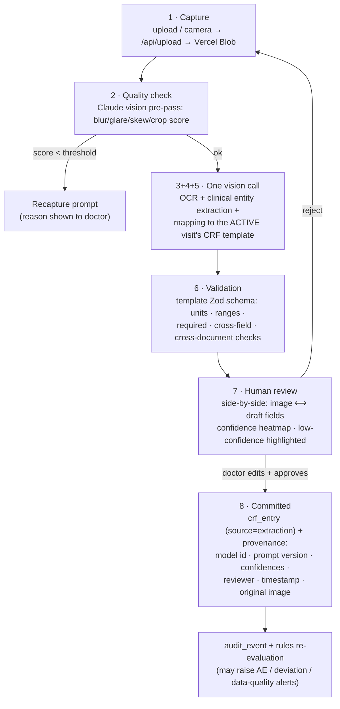

# AyuSphere — Architecture Document

System architecture for the AyuSphere CTMS. Stack rationale lives in [technology.md](technology.md), decisions in [decisions.md](decisions.md), end-to-end flows in [workflow.md](workflow.md).

---

## 1. System overview

Single Next.js full-stack application (D-001) on Vercel, backed by Neon Postgres, calling the Claude API for the two AI capabilities, storing files in Vercel Blob.

**Request paths**

- **Reads:** RSC pages query the service layer directly on the server; client dashboards revalidate through lightweight GET route handlers with SWR (D-011).
- **Writes:** always server actions → RBAC guard → Zod parse → service → rules evaluation → Drizzle transaction → audit event. No client ever touches the DB shape directly.
- **AI:** route handlers only (`/api/ai/extract`, `/api/ai/copilot`) so streaming and file handling stay off the action path.
- **Cron:** `/api/cron/alerts` (Vercel Cron — daily on Hobby, 10 min on Pro; write-time evaluation covers intra-day) sweeps time-based alert rules (overdue visits, approaching AE deadlines) that writes alone can't trigger.

## 2. Layered architecture

| Layer | Location | Responsibility | Rule |
|---|---|---|---|
| Presentation | `src/app`, `src/components` | Pages, forms, charts, motion | No business logic; renders service DTOs |
| Application | server actions + `src/services` | Use-cases, transactions, audit | Every mutation wrapped in `withAudit()` (D-010) |
| Domain | `src/lib/schemas`, `src/lib/rules` | Zod schemas, lifecycle state machine, deviation/data-quality/deadline rules | Pure TypeScript, unit-testable, no I/O |
| Data | `src/db` | Drizzle schema, queries, seed | Only services import it |
| Integration | `src/lib/ai`, export builders | Claude prompts + parsers, FHIR/SDTM mappers | AI output parsed through domain Zod schemas — AI can never bypass validation (D-012) |

## 3. Data model

### 3.1 Entity relationships

### 3.2 Tables (Drizzle schema, CDASH-aligned naming — D-017)

| Table | Key fields | Notes |
|---|---|---|
| `users` | id, email, password_hash, name, **role** (enum: `pi · coordinator · monitor · ethics · pv · admin · regulator`), site_id?, active | Seeded demo user per role |
| `trials` | id, ctri_number?, title, protocol_code, study_type (interventional/observational), phase, intervention (Ayurveda formulation, dosage form), target_enrollment, **status** (lifecycle enum), planned_start/end | Status transitions guarded by state machine (§4) |
| `sites` | id, name, city, state, pi_user_id | |
| `trial_sites` | trial_id, site_id, activation_status, activated_at, enrollment_target, monitoring_visit_due | Per-site targets drive recruitment analytics |
| `participants` | id, **subject_code** (de-identified, e.g. `AYU-001-P-0042`), trial_site_id, screening_status, eligibility, arm (randomization), consent_status, consent_date, enrolled_at, withdrawal_reason?, status | **No name/phone/address columns exist** — de-identification by schema (D-016) |
| `crf_templates` | id, trial_id, visit_type, name, version, fields (JSONB: name, label, type, unit, min, max, required, cdash_var) | Field rules compile to Zod at runtime (D-012) |
| `visits` | id, participant_id, template_id, visit_number, scheduled_date, **window_start/window_end**, completed_at?, status (upcoming/due/overdue/completed/missed) | Windows computed from protocol offsets |
| `crf_entries` | id, visit_id, template_id, data (JSONB), status (draft/submitted/approved), entered_by, approved_by?, approved_at?, source (`manual` \| `extraction`), extraction_id? | `approved` rows immutable — corrections create new versions |
| `extractions` | id, blob_url, image_quality (JSONB), raw_output (JSONB), mapped_fields (JSONB with **per-field confidence**), model_id, prompt_version, status (pending/review/approved/rejected), reviewed_by?, reviewed_at? | Full provenance for Doctor Note Intelligence (§6) |
| `adverse_events` | id, participant_id, term, meddra_code?, whodrug_code?, onset_date, **seriousness** (AE/SAE), severity, outcome, causality, narrative, **reporting_deadline**, reported_at?, status (open/under_review/reported/closed) | Deadline computed at insert (§7) |
| `ae_actions` | id, ae_id, action, actor_id, at | Escalation timeline |
| `documents` | id, trial_id, kind (protocol/ethics_approval/consent_form/monitoring_report/regulatory), version, blob_url, uploaded_by | Version history = one row per version |
| `milestones` | id, trial_id, kind (**iec_submission, iec_approval, ctri_registration**, first_enrolment, last_visit, closeout), due_date, completed_at? | Drives CTRI/ethics due alerts |
| `alerts` | id, trial_id?, site_id?, rule_key, severity, message, entity_ref, status (open/acknowledged/resolved), created_at | Written by rules engine, surfaced role-filtered |
| `signatures` | id, actor_id, actor_role, entity_type, entity_id, action (approve/correct/report), **meaning**, **payload_hash** (SHA-256), signed_at | E-signature per record-freezing action (D-022); inserted in the same transaction as the mutation it signs |
| `monitoring_visits` | id, trial_site_id, monitor_id, scheduled_date, completed_at?, summary, findings (JSONB), report_document_id? | Monitor's site visits (T7.3); completing advances `trial_sites.monitoring_visit_due` by the configured cadence |
| `audit_events` | id, actor_id, actor_role, action, entity_type, entity_id, before (JSONB), after (JSONB), at, request_id | **INSERT-only** (§5) |

## 4. Trial lifecycle state machine

The PS's lifecycle chain is enforced as an explicit state machine in `src/lib/rules/lifecycle.ts` — services refuse invalid transitions; the ethics gate belongs to the ethics role only.

Guards worth noting: a trial cannot reach `active` without an `iec_approval` milestone **and** a `ctri_number` (prospective-registration rule from the PS); participants can only be enrolled while `active`; every transition writes an audit event and re-evaluates milestone alerts.

## 5. Audit trail (ALCOA+) — D-010

- `withAudit(action, fn)` wraps every service mutation: runs `fn` in a Drizzle transaction, captures before/after snapshots, inserts the `audit_events` row **in the same transaction** (an unaudited write cannot commit).
- The application DB role has **no UPDATE/DELETE grant** on `audit_events` — immutability enforced at the database, not by convention.
- No hard deletes anywhere: domain rows carry status/soft-delete fields.
- Approved CRF entries and reported AEs are frozen; corrections create a new version linked to the old, so the full ALCOA+ chain (attributable → available) is walkable in the audit browser (workflow.md §13).
- Login/logout, permission-denied attempts, exports, and AI extraction approvals are audited too — these are the rows that make the regulator view convincing.

## 6. Doctor Note Intelligence pipeline (D-005)

The 8-step pipeline from the feature plan, mapped to components:

Design points:

- **Protocol-aware prompting:** the extraction prompt embeds the participant's *current visit* CRF template (fields, types, units), so Claude returns exactly that shape — structured JSON with `{value, confidence, source_text}` per field — parsed through the same Zod schema as manual entry.
- **Confidence heatmap:** fields render green/amber/red by confidence band; amber/red require explicit doctor touch before the approve button enables.
- **Nothing auto-commits.** An extraction is never an official record until a doctor approves it (PS human-oversight requirement); the original image stays attached as source evidence.
- **Cross-document consistency:** validation compares the draft against the participant's approved history (dose changes, impossible date sequences, unit flips) and flags contradictions — one is planted in the seed data as the demo moment.

## 7. AE/SAE escalation clock

- On AE insert, the **deadline engine** (`src/lib/rules/deadlines.ts`) computes `reporting_deadline` from a config table of NDCT-style rules (e.g. SAE → 24h initial notification, 14d detailed report; configurable, not hard-coded — the demo states these are representative values).
- The clock component renders a countdown ring (Framer Motion animated) that shifts amber → red through thresholds; breached deadlines raise a `danger` alert and appear on the PV dashboard first.
- Every state change (capture → review → reported → closed) appends to `ae_actions`, giving the escalation timeline shown on the AE detail page and feeding the "timeliness of safety reporting" evaluation axis.

## 8. Alerts & rules engine

Two evaluation triggers, one rule registry (`src/lib/rules/alerts.ts`):

1. **On write** — any mutation re-evaluates rules touching that entity (e.g. enrolling a participant updates site recruitment velocity; approving a CRF may raise a deviation).
2. **On schedule** — Vercel Cron (daily on Hobby; 10 min on Pro) sweeps time-based rules: overdue visits (past `window_end`), approaching/breached AE deadlines, upcoming milestone due dates (CTRI/ethics), stale monitoring visits.

Built-in rule set (each maps to a PS-named alert): `enrolment_lag`, `visit_overdue`, `ae_deadline_approaching`, `ae_deadline_breached`, `milestone_due` (ethics/CTRI), `monitoring_overdue`, `data_quality` (missing/inconsistent/duplicate/impossible values), `protocol_deviation` (missed/out-of-window visit, missing required assessment). Alerts are idempotent (rule_key + entity_ref unique while open) and role-routed (PV sees safety, coordinators see visits, admin sees everything). Rule thresholds (lag %, AE warning window, milestone lookahead, monitoring cadence) and the AE/SAE deadline-rule table are **admin-configurable** via the `alert_config` document in `app_settings` (D-023) with the built-in values as defaults — the PS's "configurable KPIs and alerting".

## 9. AI Copilot (grounded Q&A)

- Flow: question → intent-scoped retrieval (parameterized queries over **only the tables the asker's role may read**, enforced by the same RBAC layer as the UI) → compact JSON context → Claude answer constrained to cite record ids → UI renders citations as links to the actual records.
- The Copilot has **no write path and no raw SQL**; it selects from a whitelist of retrieval functions (`sitesBehindTarget()`, `openSAEs()`, `trialSummary(id)` …). If retrieval returns nothing, the answer says so rather than speculating — this is the deck's hallucination control demonstrated literally.
- Every Copilot exchange is logged (question, retrieval set, answer) for the audit narrative.

## 10. RBAC model

Single source: `src/lib/rbac.ts` — a permission matrix consumed by (a) middleware for route access, (b) services for row-level checks, (c) UI for conditional rendering. Never UI-only.

| Capability | PI | Coord | Monitor | Ethics | PV | Admin | Regulator |
|---|---|---|---|---|---|---|---|
| Create/edit trials | ✅ | ✅ | — | — | — | ✅ | — |
| Ethics approve/return | — | — | — | ✅ | — | — | — |
| Enrol participants / CRF entry | ✅ | ✅ | — | — | — | — | — |
| Approve CRF / extractions | ✅ | — | — | — | — | — | — |
| Capture AE | ✅ | ✅ | — | — | ✅ | — | — |
| Review/report AE·SAE | — | — | — | — | ✅ | — | — |
| Monitoring visit logs | — | — | ✅ | — | — | — | — |
| Raise/close data queries (T10.1) | — | — | ✅ | — | — | ✅ | — |
| Exports (FHIR/SDTM) | ✅ | — | — | — | ✅ | ✅ | — |
| User management / settings | — | — | — | — | — | ✅ | — |
| Audit browser | — | — | — | — | — | ✅ | ✅ (read-only) |
| Dashboards | own trials | own trials | assigned sites | pending reviews | safety portfolio | all | all (read-only) |

Scoping rules: PI/coordinator see their trials; monitors their assigned sites; regulator sees everything but can mutate nothing (every regulator view renders from the same components with mutations stripped — one code path, not a fork).

## 11. FHIR / SDTM export architecture (D-017)

- Pure mapper functions in `src/services/export/`: Drizzle rows → FHIR R4 JSON (`ResearchStudy`, `ResearchSubject`, de-identified `Patient`, `AdverseEvent`) bundled per trial; and → SDTM `DM` / `AE` domain CSVs with a Define-XML stub describing them.
- Because CRF fields carry `cdash_var` names from creation, SDTM export is projection, not transformation.
- Exports are audited (who exported what, when) and downloadable from the Exports page — the artifact judges can open.
- **Live FHIR API + inbound path (T9.3, D-026):** authenticated, audited read endpoints `GET /api/fhir/Bundle/[trialId]` and `GET /api/fhir/ResearchStudy/[id]` serve the same mappers as `application/fhir+json` (regulator gets read via `audit.view`); `POST /api/fhir/import` accepts an Observation bundle from an EDC/HIS and creates a **draft** CRF entry mapped through the visit's template — imported data flows through the normal validate → submit → signed-approve path, never auto-committing.
- **ABDM posture:** the FHIR R4 endpoints are the ABDM-compatible building block; ABHA-linked identifiers deliberately stay OUTSIDE the de-identified research schema (D-016) — linkage would live in a separate consented care-context layer in production. Stated as roadmap, not mocked.

## 12. Security posture

- **Transport/at rest:** TLS everywhere; Neon encrypts at rest (AES-256); Blob objects private, served through an authorizing route handler.
- **Sessions:** Auth.js JWT (httpOnly, secure, sameSite=lax), 12h expiry; bcrypt (cost 12); login rate-limited per IP+email.
- **Input:** every boundary Zod-parsed (actions, route handlers, AI outputs); Drizzle parameterizes all SQL.
- **Secrets:** env-only, never client-bundled; `ANTHROPIC_API_KEY` used exclusively in route handlers.
- **Privacy by schema:** the participants table cannot store direct identifiers (D-016); DPDP posture = minimisation + consent fields + synthetic data in all environments.
- **Honest caveats for the demo:** Neon/Vercel regions are the dev/demo host; the production narrative names India data-resident, ISO 27001 / CERT-In infrastructure (D-002, D-014). MVP e-signature (implemented, D-022/T7.1): password re-authentication + signature meaning + SHA-256 payload hash + timestamp in the `signatures` table, committed atomically with the signed mutation — stated plainly as an MVP e-sign (no PKI).
